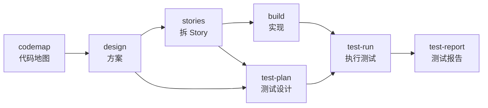

# nova

一个兼容 Codex 和 Claude Code 的插件：从需求到上线前的 AI 编程流程（代码地图 → 方案 → Story → 实现 → 测试），加上飞书文档协作和工作进度交接。

## 包含什么

### 开发流程



| skill | 做什么 | 产物 |
|---|---|---|
| `nova:codemap` | 读代码生成代码地图：模块、入口、数据、关键流程、业务规则、约定；支持增量更新 | `docs/codemap/【程序】/` |
| `nova:design` | 先对齐目标，再一个 agent 写、一个 agent 评（最多 3 轮），交你拍板；技术方案和通用方案两种模板；可发飞书收评论 | `docs/nova/【功能】/goal.md`、`design.md` |
| `nova:stories` | 把定稿方案拆成 Story，每条验收标准指明生产代码入口 | `stories.json`、`stories.md` |
| `nova:build` | 每个 Story 在独立 worktree 里测试驱动开发 → 通用/对抗/边界三路代码评审 → 独立验收 → 合并；最多返工 3 轮 | 分支 `nova/【功能】` |
| `nova:test-plan` | 列判据项 → 拆有依据的原子测试点 → 生成用例，写评分离 | `testplan.json`、`test-plan.md` |
| `nova:test-run` | 用例写成自动化测试并执行，人工用例交你执行，登记缺陷，支持复测 | 分支 `nova/【功能】-test`、`defects.json` |
| `nova:test-report` | 按固定规则给出通过 / 有条件通过 / 不通过，出报告，可发飞书 | `test-report.md` |

各步可以单独用：只想要代码地图、只写一份方案、只给现有功能补测试都行。

### 飞书协作与进度交接

| skill | 做什么 |
|---|---|
| `nova:feishu-comment` | 按飞书评论改文档：明确的意见改进正文，要拍板的记进「待决策」表，处理过的评论标为已解决 |
| `nova:feishu-diagram` | 在飞书文档里画可编辑的图（mermaid / SVG / 配色思维导图），也能改已有的图 |
| `nova:feishu-wiki` | 体检 wiki 目录结构，出带勾选框的整理报告；勾选后执行移动、归档、改名、新建 |
| `nova:save` / `nova:restore` | 写交接单并推到项目 git 的 `nova-handoff` 分支；新会话或另一台机器上恢复 |

### agent

| agent | 职责 | 谁派 |
|---|---|---|
| `codemapper` | 读代码写代码地图 | codemap |
| `doc-writer` | 按模板写或改文档 | design、stories、test-plan |
| `doc-reviewer` | 评审文档，只评不改 | design、stories、test-plan |
| `implementer` | 在 worktree 里测试驱动实现 | build |
| `code-reviewer` | 三种视角之一评审代码 | build |
| `verifier` | 独立验收 | build |
| `test-runner` | 写自动化测试并执行、区分失败原因 | test-run |

## 设计原则

- **本地文件是正本**，飞书只用来展示和收评论。
- **写和评分开**：写的 agent 和评的 agent 互不相干，主会话核实每个严重问题再裁定。
- **有据可查**：关于现有代码的每句话带 `路径:行号`，脚本 `refcheck.py` 机械核对。
- **该你拍板的交给你**：方向、范围、优先级、取舍进「待决策」表，agent 只给选项和建议。
- **能用脚本算的不交给模型**：盘点、校验、排序、合并评审、统计和结论都由脚本完成并有测试。

## 准备

- Codex（支持插件和子 agent 的版本）或 [Claude Code](https://claude.com/claude-code)。代码地图、写评分离、实现与验收需要子 agent；飞书操作、交接和报告生成可单独使用。
- Python 3.10+、git。skill 里的 `python` 可替换为本机的 `python3` 或解释器绝对路径；Windows 下用 `python -X utf8`，避免中文和符号的编码问题。
- 飞书官方命令行 lark-cli：`feishu-comment`、`feishu-diagram`、`feishu-wiki` 和「发布到飞书」都靠它；不用飞书可以跳过。在自己的终端里做三步：
  1. 安装：`npm install -g @larksuite/cli`
  2. 绑定飞书应用：`lark-cli config init`，按提示新建一个应用，或填入已有自建应用的 App ID 和 App Secret
  3. 在[飞书开放平台](https://open.feishu.cn/app)给这个应用开通下面的**用户身份**权限，然后 `lark-cli auth login` 登录

  需要的权限：云文档读写（`docx:document:*`）、文档评论（`docs:document.comment:*`）、知识库节点（`wiki:node:read/create/move/retrieve`、`wiki:space:read`）、画板（`board:whiteboard:node:create/read`）。缺权限时 lark-cli 会报 `missing_scope` 并列出缺什么，在开放平台补开通后重新登录即可。

## 安装

### Codex

本地源码安装（在终端里运行，路径换成自己的仓库目录）：

```powershell
codex plugin marketplace add E:\Code\nova
codex plugin add nova@nova
```

适配提交推到 GitHub 后，也可以从仓库安装：

```bash
codex plugin marketplace add https://github.com/Attacker687/nova.git
codex plugin add nova@nova
```

装好后打开新聊天，在技能选择器里选择 nova 的对应 skill，或直接说「用 nova 为当前项目生成代码地图」「用 nova 写技术方案」「用 nova 恢复进度」。本文的 `nova:design` 等名称表示插件里的工作流，不需要在 shell 中执行。

Codex 和 Claude Code 共用同一套 skill、角色文件与 Python 脚本，具体的工具映射见 [运行环境约定](plugins/nova/references/runtime.md)。Codex 不会自动注册 `agents/*.md` 中的 Claude agent；skill 会读取角色说明，再派出独立子 agent。并发数随宿主调整，评审和验收仍与实现分开；缺少子 agent 能力时会报告未完成的步骤。

Codex app 提供 worktree 管理工具时使用托管目录；CLI 环境使用 git worktree。实际路径保存在 `.nova/【功能】/build/worktrees.json` 或 `test/worktrees.json`，中断后据此恢复。

更新本地源码后，先更新插件版本再重新安装。开发时可只给 `.codex-plugin/plugin.json` 的版本追加或替换 `+codex.【唯一标记】`（例如 `0.2.1+codex.dev1`），以刷新缓存：

```powershell
codex plugin add nova@nova
```

已安装的版本来自插件缓存；发布更新时同步修改两个插件清单的版本号。Git 来源的安装先 `codex plugin marketplace upgrade nova`，再重新安装，最后打开新聊天。

### Claude Code

在 Claude Code 里：

```text
/plugin marketplace add Attacker687/nova
/plugin install nova@nova
```

装好后开新会话生效。

更新到新版（在终端里运行，然后重开 Claude Code）：

```bash
claude plugin marketplace update nova
claude plugin update nova@nova
```

### Claude Code 团队配置

把下面内容加进项目的 `.claude/settings.json` 并提交。同事打开项目、信任这个文件夹后，Claude Code 会提示安装 nova：

```json
{
  "extraKnownMarketplaces": {
    "nova": {
      "source": { "source": "github", "repo": "Attacker687/nova" }
    }
  },
  "enabledPlugins": {
    "nova@nova": true
  }
}
```

## 会在哪里留下文件

| 位置 | 内容 | 建议 |
|---|---|---|
| `docs/codemap/`、`docs/nova/` | 代码地图、目标、方案、Story、测试方案、缺陷、报告 | 提交进 git |
| `.nova/` | 写评过程、评审结果、构建状态、测试结果、worktree 路径记录、手动 worktree、本机交接单 | 不提交；nova 会把它加进 git 的本机 exclude 文件 |
| 分支 `nova/【功能】`、`nova/【功能】-test` | 实现和测试代码 | 审阅后合并 |
| 分支 `nova-handoff` | 推到远端的交接单 | 与主分支历史无关 |
| `~/.nova/wiki/` | wiki 整理的快照和执行计划 | 用完可删 |

## 开发

```text
.agents/plugins/marketplace.json Codex 插件市场
.claude-plugin/marketplace.json   Claude Code 插件市场
plugins/nova/
  .codex-plugin/plugin.json        Codex 插件清单
  .claude-plugin/plugin.json
  agents/                         7 个角色：Claude 原生 agent / Codex 子 agent 参考
  references/                     共用规则：runtime.md、lark-cli.md、grounding.md、review-format.md、review-loop.md
  skills/【skill】/SKILL.md        skill 主流程
  skills/【skill】/scripts/        确定性脚本（只用 Python 标准库）
  skills/【skill】/references/     只有这个 skill 用的参考
  skills/【skill】/templates/      模板
tests/                            脚本的测试
```

- 跑测试：`python -m pytest tests/`
- 本地调试：Codex 按上面的本地源码安装；Claude Code 用 `/plugin marketplace add 【本地克隆路径】` 再 `/plugin install nova@nova`。改了源码后重新安装，开新会话生效。
- 发新版：两个 `plugin.json` 和 `.claude-plugin/marketplace.json` 里的 `version` 一起改，移除本地开发用的 `+codex.…` 后缀，推到 GitHub 后别人按「安装」一节的更新命令拿到新版。
- 一条规则只写在一个地方：宿主适配在 `runtime.md`，飞书用法在 `lark-cli.md`，写评循环在 `review-loop.md`，skill 引用它们而不重复。不要只复制 `skills/` 子目录安装，跨 skill 的脚本、共享规则和角色文件都需要随插件保留。
